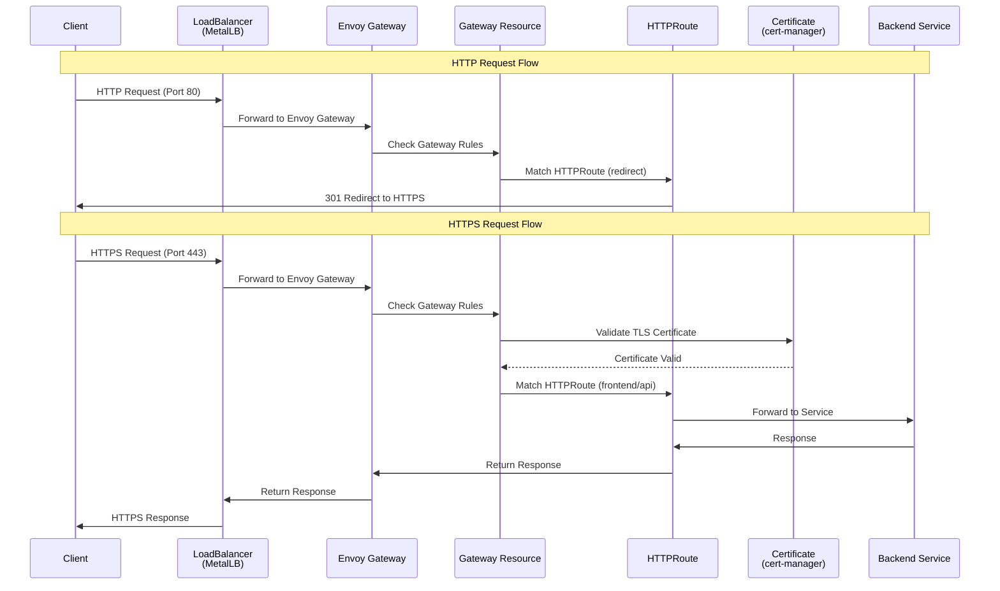
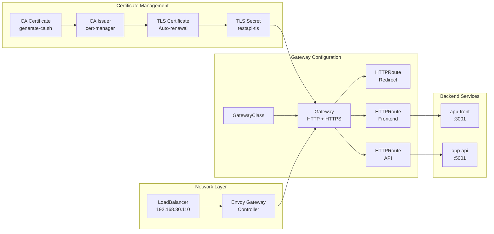
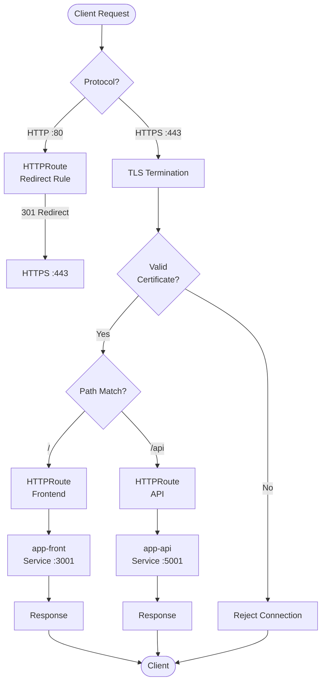
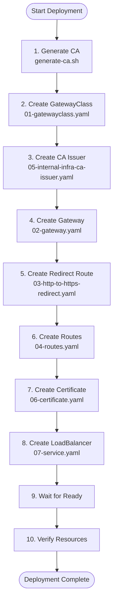
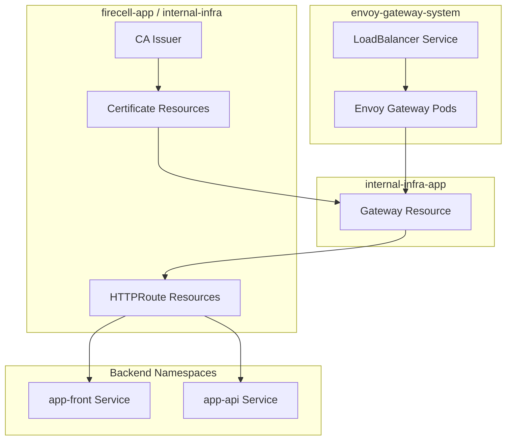

# Envoy Gateway Architecture Diagram

## Detailed Architecture Flow

```mermaid
sequenceDiagram
    participant Client
    participant LB as LoadBalancer<br/>(MetalLB)
    participant EG as Envoy Gateway
    participant GW as Gateway Resource
    participant Route as HTTPRoute
    participant Cert as Certificate<br/>(cert-manager)
    participant Backend as Backend Service

    Note over Client,Backend: HTTP Request Flow
    Client->>LB: HTTP Request (Port 80)
    LB->>EG: Forward to Envoy Gateway
    EG->>GW: Check Gateway Rules
    GW->>Route: Match HTTPRoute (redirect)
    Route->>Client: 301 Redirect to HTTPS

    Note over Client,Backend: HTTPS Request Flow
    Client->>LB: HTTPS Request (Port 443)
    LB->>EG: Forward to Envoy Gateway
    EG->>GW: Check Gateway Rules
    GW->>Cert: Validate TLS Certificate
    Cert-->>GW: Certificate Valid
    GW->>Route: Match HTTPRoute (frontend/api)
    Route->>Backend: Forward to Service
    Backend->>Route: Response
    Route->>EG: Return Response
    EG->>LB: Return Response
    LB->>Client: HTTPS Response
```

## Component Interaction Diagram

```mermaid
graph LR
    subgraph "Certificate Management"
        CA[CA Certificate<br/>generate-ca.sh]
        Issuer[CA Issuer<br/>cert-manager]
        Cert[TLS Certificate<br/>Auto-renewal]
        Secret[TLS Secret<br/>testapi-tls]
    end
    
    subgraph "Gateway Configuration"
        GC[GatewayClass]
        GW[Gateway<br/>HTTP + HTTPS]
        Route1[HTTPRoute<br/>Redirect]
        Route2[HTTPRoute<br/>Frontend]
        Route3[HTTPRoute<br/>API]
    end
    
    subgraph "Network Layer"
        LB[LoadBalancer<br/>192.168.30.110]
        EG[Envoy Gateway<br/>Controller]
    end
    
    subgraph "Backend Services"
        Frontend[app-front<br/>:3001]
        API[app-api<br/>:5001]
    end
    
    CA --> Issuer
    Issuer --> Cert
    Cert --> Secret
    Secret --> GW
    
    GC --> GW
    GW --> Route1
    GW --> Route2
    GW --> Route3
    
    LB --> EG
    EG --> GW
    
    Route2 --> Frontend
    Route3 --> API
```

## Traffic Flow Diagram

```mermaid
flowchart TD
    Start([Client Request]) --> Protocol{Protocol?}
    
    Protocol -->|HTTP :80| Redirect[HTTPRoute<br/>Redirect Rule]
    Redirect -->|301 Redirect| HTTPS[HTTPS :443]
    
    Protocol -->|HTTPS :443| TLS[TLS Termination]
    TLS --> Validate{Valid<br/>Certificate?}
    
    Validate -->|No| Reject[Reject Connection]
    Validate -->|Yes| Route{Path Match?}
    
    Route -->|/| FrontendRoute[HTTPRoute<br/>Frontend]
    Route -->|/api| APIRoute[HTTPRoute<br/>API]
    
    FrontendRoute --> FrontendSvc[app-front<br/>Service :3001]
    APIRoute --> APISvc[app-api<br/>Service :5001]
    
    FrontendSvc --> Response1[Response]
    APISvc --> Response2[Response]
    
    Response1 --> End([Client])
    Response2 --> End
    Reject --> End
```

## Deployment Sequence

```mermaid
graph TD
    Start([Start Deployment]) --> CA[1. Generate CA<br/>generate-ca.sh]
    CA --> GC[2. Create GatewayClass<br/>01-gatewayclass.yaml]
    GC --> Issuer[3. Create CA Issuer<br/>05-internal-infra-ca-issuer.yaml]
    Issuer --> GW[4. Create Gateway<br/>02-gateway.yaml]
    GW --> Redirect[5. Create Redirect Route<br/>03-http-to-https-redirect.yaml]
    Redirect --> Routes[6. Create Routes<br/>04-routes.yaml]
    Routes --> Cert[7. Create Certificate<br/>06-certificate.yaml]
    Cert --> LB[8. Create LoadBalancer<br/>07-service.yaml]
    LB --> Wait[9. Wait for Ready]
    Wait --> Verify[10. Verify Resources]
    Verify --> Complete([Deployment Complete])
```

## Namespace Organization

```mermaid
graph TB
    subgraph "envoy-gateway-system"
        LB_NS[LoadBalancer Service]
        EG_NS[Envoy Gateway Pods]
    end
    
    subgraph "internal-infra-app"
        GW_NS[Gateway Resource]
    end
    
    subgraph "firecell-app / internal-infra"
        Route_NS[HTTPRoute Resources]
        Cert_NS[Certificate Resources]
        Issuer_NS[CA Issuer]
    end
    
    subgraph "Backend Namespaces"
        Frontend_NS[app-front Service]
        API_NS[app-api Service]
    end
    
    LB_NS --> EG_NS
    EG_NS --> GW_NS
    GW_NS --> Route_NS
    Route_NS --> Frontend_NS
    Route_NS --> API_NS
    Issuer_NS --> Cert_NS
    Cert_NS --> GW_NS
```

