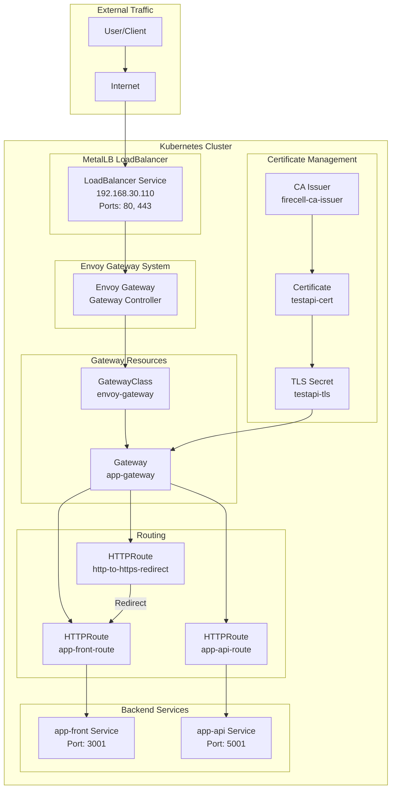

# Envoy Gateway Setup for Kubernetes

A complete Kubernetes Gateway API setup using Envoy Gateway with TLS termination, HTTP to HTTPS redirect, and certificate management via cert-manager.

## 📋 Overview

This repository contains a production-ready configuration for deploying Envoy Gateway in a Kubernetes cluster. The setup includes:

- **Gateway API** resources (GatewayClass, Gateway, HTTPRoute)
- **TLS/SSL** certificate management with cert-manager
- **HTTP to HTTPS** automatic redirect
- **LoadBalancer** service configuration with MetalLB
- **Automated deployment** scripts

## 🏗️ Architecture



## 📁 Project Structure

```
envoy-proxy-setup/
├── 01-gatewayclass.yaml          # GatewayClass definition
├── 02-gateway.yaml                # Gateway resource with HTTP/HTTPS listeners
├── 03-http-to-https-redirect.yaml # HTTP to HTTPS redirect route
├── 04-routes.yaml                 # Frontend and API routing rules
├── 05-internal-infra-ca-issuer.yaml # cert-manager CA Issuer
├── 06-certificate.yaml            # TLS certificate definition
├── 07-service.yaml                # LoadBalancer service for MetalLB
├── scripts/
│   ├── deploy-all.sh              # Automated deployment script
│   └── generate-ca.sh             # CA certificate generation script
└── README.md                       # This file
```

## 🚀 Prerequisites

Before deploying this setup, ensure you have:

1. **Kubernetes Cluster** (tested with MicroK8s)
2. **Envoy Gateway** installed and running
3. **cert-manager** installed in your cluster
4. **MetalLB** configured (for LoadBalancer support)
5. **kubectl** configured to access your cluster
6. **OpenSSL** (for CA generation)

## 📦 Installation

### Step 1: Generate CA Certificate

First, generate the Certificate Authority (CA) that will be used to issue TLS certificates:

```bash
cd scripts
chmod +x generate-ca.sh
./generate-ca.sh
```

This script will:
- Generate a CA private key and certificate
- Create a Kubernetes secret `internal-infra-ca` in the `internal-infra` namespace
- Store certificates in the `certs/` directory

### Step 2: Deploy Resources

Deploy all resources in the correct order:

```bash
chmod +x scripts/deploy-all.sh
./scripts/deploy-all.sh
```

Or deploy manually in order:

```bash
# 1. Create GatewayClass
kubectl apply -f 01-gatewayclass.yaml

# 2. Create CA Issuer
kubectl apply -f 05-internal-infra-ca-issuer.yaml

# 3. Create Gateway
kubectl apply -f 02-gateway.yaml

# 4. Create HTTP to HTTPS redirect
kubectl apply -f 03-http-to-https-redirect.yaml

# 5. Create routes
kubectl apply -f 04-routes.yaml

# 6. Create certificate
kubectl apply -f 06-certificate.yaml

# 7. Create LoadBalancer service
kubectl apply -f 07-service.yaml
```

## 🔧 Configuration Details

### GatewayClass (`01-gatewayclass.yaml`)

Defines the GatewayClass that Envoy Gateway will use:

- **Controller**: `gateway.envoyproxy.io/gatewayclass-controller`
- **Name**: `envoy-gateway`

### Gateway (`02-gateway.yaml`)

Configures the main gateway with two listeners:

- **HTTP Listener**: Port 80 for `testapi.internal-infra.net`
- **HTTPS Listener**: Port 443 for `testapi.internal-infra.net` with TLS termination

**Namespace**: `internal-infra-app`

### HTTP to HTTPS Redirect (`03-http-to-https-redirect.yaml`)

Automatically redirects all HTTP traffic to HTTPS:

- **Status Code**: 301 (Permanent Redirect)
- **Target**: HTTPS on port 443
- **Hostname**: `testapi.firecell.net`

### Routes (`04-routes.yaml`)

Defines two HTTPRoute resources:

1. **Frontend Route** (`app-front-route`):
   - Path: `/`
   - Backend: `app-front` service on port 3001

2. **API Route** (`app-api-route`):
   - Path: `/api` and `/api/`
   - Backend: `app-api` service on port 5001

### Certificate Management

#### CA Issuer (`05-internal-infra-ca-issuer.yaml`)

Creates a cert-manager Issuer that uses the CA certificate:

- **Type**: CA Issuer
- **Secret**: `firecell-ca` (created by generate-ca.sh)
- **Namespace**: `firecell-app`

#### Certificate (`06-certificate.yaml`)

Defines the TLS certificate for the domain:

- **Domain**: `testapi.firecell.net`
- **Additional DNS Names**: `app.firecell.net`
- **Validity**: 30 days (720 hours)
- **Renewal**: 24 hours before expiration
- **Key Size**: 2048 bits RSA

### LoadBalancer Service (`07-service.yaml`)

Configures MetalLB to assign a static IP to the Envoy Gateway:

- **IP Address**: `192.168.30.110`
- **Ports**: 
  - HTTP: 80 → 10080 (NodePort: 30080)
  - HTTPS: 443 → 10443 (NodePort: 30443)
- **Namespace**: `envoy-gateway-system`

## 🔍 Verification

After deployment, verify the resources:

```bash
# Check GatewayClass
kubectl get gatewayclass

# Check Gateway
kubectl get gateway -n internal-infra-app

# Check HTTPRoutes
kubectl get httproute -A

# Check Certificate status
kubectl get certificate -n firecell-app
kubectl describe certificate testapi-cert -n firecell-app

# Check TLS Secret
kubectl get secret testapi-tls -n firecell-app

# Check LoadBalancer service
kubectl get svc app-gateway-lb -n envoy-gateway-system

# Check Gateway status
kubectl describe gateway app-gateway -n internal-infra-app
```

## 🌐 Accessing the Services

Once deployed, you can access your services:

- **Frontend**: `https://testapi.firecell.net/`
- **API**: `https://testapi.firecell.net/api`

HTTP requests will automatically redirect to HTTPS.

## 🔐 Security Considerations

1. **CA Certificate**: Keep the CA private key (`certs/ca.key`) secure and backed up
2. **Certificate Rotation**: Certificates auto-renew 24 hours before expiration
3. **TLS Termination**: All TLS is terminated at the gateway level
4. **Namespace Isolation**: Resources are organized in appropriate namespaces

## 🛠️ Troubleshooting

### Certificate Not Ready

```bash
# Check certificate status
kubectl describe certificate testapi-cert -n firecell-app

# Check cert-manager logs
kubectl logs -n cert-manager -l app=cert-manager
```

### Gateway Not Programmed

```bash
# Check gateway status
kubectl describe gateway app-gateway -n internal-infra-app

# Check Envoy Gateway logs
kubectl logs -n envoy-gateway-system -l app.kubernetes.io/name=envoy-gateway
```

### LoadBalancer IP Not Assigned

```bash
# Check MetalLB status
kubectl get svc app-gateway-lb -n envoy-gateway-system

# Verify MetalLB configuration
kubectl get ipaddresspool -n metallb-system
```

## 📚 Resources

- [Envoy Gateway Documentation](https://gateway.envoyproxy.io/)
- [Kubernetes Gateway API](https://gateway-api.sigs.k8s.io/)
- [cert-manager Documentation](https://cert-manager.io/docs/)
- [MetalLB Documentation](https://metallb.universe.tf/)

## 📝 License

This project is provided as-is for educational and production use.

## 🤝 Contributing

Contributions are welcome! Please feel free to submit a Pull Request.

---

**Note**: Remember to update the hostnames, IP addresses, and namespaces according to your environment before deploying.

